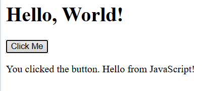

# Hello World 🌍

This is a simple "Hello World" project built using HTML and JavaScript. It's a great starting point for beginners learning how to link JS to a web page.

##  Features

- Displays "Hello, World!" in the browser
- Click a button to show a greeting with JavaScript
- Simple structure using HTML + JS

##  Project Structure

hello-world/
│
├── index.html
└── script.js

##  What I Learned

- Basic HTML structure
- Connecting external JavaScript to HTML
- DOM manipulation and event handling

##  How to Run

1. Clone or download this repo.
2. Open `index.html` in your browser.
3. Click the button and see the magic!

##  Preview

 *(Add a screenshot if available)*

## 📄 License

This project is open source and free to use.