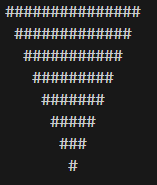

# Pyramid Generator 

This is a simple JavaScript script that generates a pyramid shape using symbols like `#` or `*`.

It was one of my early practice exercises to get more comfortable with `for` loops, string manipulation, and basic algorithmic thinking.

---

## What it does

- Generates a text-based pyramid in the console
- You can adjust the height of the pyramid easily by changing a variable

---

## Why I made it

I built this while practicing loop structures and logic building. It really helped me understand how spacing and alignment work when printing patterns — something that's useful even in more complex projects.

---

## How to use

1. Open the `.js` file in any code editor or browser console.
2. Set the height of the pyramid in the variable.
3. Run the code and watch it generate the shape in your console.

---

It’s simple, but building it taught me a lot.

