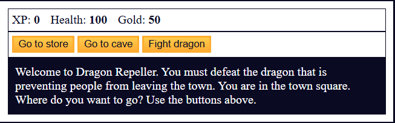

# Role Playing Game

A simple JavaScript-based role-playing game (RPG) engine designed to practice object-oriented programming, basic game logic, and event handling.

## Features

- Turn-based combat system
- Player and enemy stats (health, attack, defense)
- Battle loop with random damage and outcomes
- Clean, modular code for easy extension

## Demo

Open `index.html` in your browser or visit the live demo:  
<https://sadykovismail.github.io/Java-script/04-role-playing-game/>




## What I Learned

- Using constructors or classes to create game entities
- Handling game state with loops and conditionals
- Applying randomness with `Math.random()`
- Structuring code for reusability

## Installation

_No dependencies required!_

1. Clone this repo:  
   ```bash
   git clone https://github.com/sadykovIsmail/Java-script/tree/main/04-role-playing-game/
Open index.html in any modern browser.

## How to Use

1. Clone or download the project files.
2. Open the main `.js` file in a code editor.
3. Run it in the browser console or Node.js.
4. Follow the combat log printed to the console.
5. Customize characters, stats, or add new enemies to expand the game.

## Tech Stack
HTML5 for structure

CSS3 for styling

Vanilla JavaScript (ES6+) for logic and localStorage integration

## File Structure
``bash
calorie-counter/
├── index.html      # Main landing page
├── css/
│   └── styles.css  # App styles
├── js/
│   └── script.js      # Core logic
└── README.md       # Project documentation

## Contributing
1) Fork the repo

2) Create a new branch:
git checkout -b feature/<your-branch-name>

3) Commit your changes:
git commit -m "Add awesome feature"

4) Push to the branch:
git push -u origin feature/<your-branch-name>

5) Open a Pull Request
