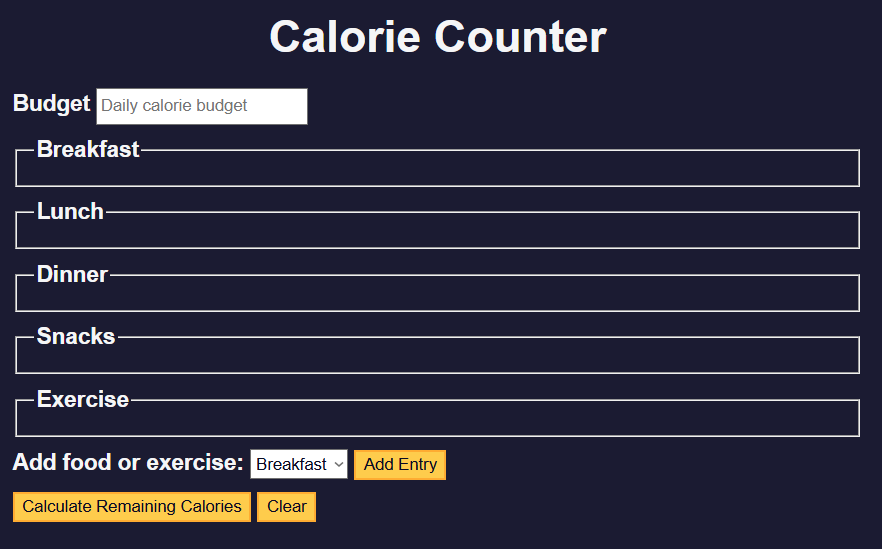

# Calorie Counter

A simple web app to track your daily calorie intake. Quickly add foods and see your running total to stay on target with your nutrition goals.

## Features

- **Add Entry**: Input a food name and its calorie count  
- **Live Total**: See your total calories update in real time
- **List Management**: Edit or remove any entry  
- **Persistent Storage**: Data is saved in your browser’s `localStorage` so your list stays intact on refresh  

## Demo

Open `index.html` in your browser or visit the live demo:  
<https://sadykovismail.github.io/Java-script/05-calorie-counter/>




## Installation

_No dependencies required!_

1. Clone this repo:  
   ```bash
   git clone https://github.com/sadykovIsmail/Java-script/tree/main/05-calorie-counter
Open index.html in any modern browser.

Usage
In the Food field, type the name of your meal or snack.

In the Calories field, enter the energy value (number only).

Click Add.

To edit an entry, click the pencil icon next to it.

To remove an entry, click the trash icon.

Your total calories for the day will always appear at the bottom.

Tech Stack
HTML5 for structure

CSS3 for styling

Vanilla JavaScript (ES6+) for logic and localStorage integration

File Structure
``bash
calorie-counter/
├── index.html      # Main landing page
├── css/
│   └── styles.css  # App styles
├── js/
│   └── script.js      # Core logic
└── README.md       # Project documentation
Contributing
Fork the repo

Create a new branch (git checkout -b feature/<your-branch-name>)

git commit -m "Add awesome feature"

Push to the branch (git push -u origin feature/<your-branch-name>)

Open a Pull Request