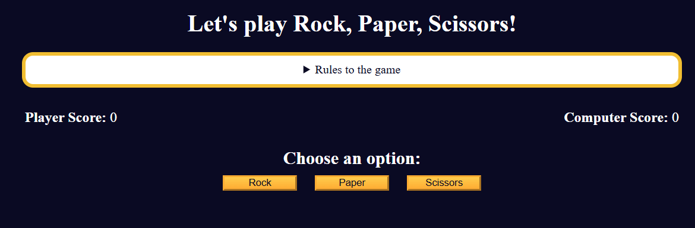

# Rock Paper Scissors

A classic hand game implemented as a web app. Play against the computer and see who wins each round!

## Features

- **Player Choice**: Click Rock, Paper, or Scissors to make your move  
- **Computer Opponent**: Randomly generates its own choice each round  
- **Result Display**: Shows “You Win!”, “You Lose!”, or “Draw!” after each play  
- **Score Tracking**: Keeps a running tally of wins, losses, and draws  
- **Reset Game**: Clear scores and start fresh at any time  

## Demo

Open `index.html` in your browser or visit the live demo:  
<https://your-username.github.io/rock-paper-scissors/>



## Installation

_No build or dependencies required!_

1. Clone this repo:  
   ```bash
   git clone https://github.com/sadykovIsmail/Java-script/tree/main/06-rock-paper-scissors-game
Open index.html in any modern browser.

Usage
Click one of the three buttons: Rock, Paper, or Scissors.

Watch the computer’s choice appear.

See the result message and updated score.

To start over, click Reset.

Tech Stack
HTML5 for markup

CSS3 for styling and responsive layout

Vanilla JavaScript (ES6+) for game logic and DOM manipulation

File Structure
``bash
rock-paper-scissors/
├── index.html         # Main page
├── css/
│   └── styles.css     # App styles
├── js/
│   └── script.js        # Game logic
└── README.md          # Project documentation
Contributing
Fork the repo

Create a new branch (git checkout -b feature/<your-branch-name>)

Commit your changes (git commit -m "Add awesome feature")

Push to the branch (git push -u origin feature/<your-branch-name>)

Open a Pull Request