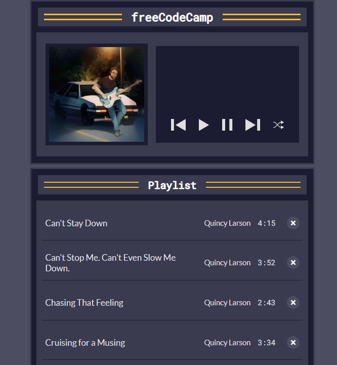

# Music Player

A lightweight web app to play your favorite tracks right in the browser. Supports playback controls, track listing, and basic volume/progress features.

## Features

- **Play / Pause**: Start or pause the current track  
- **Next / Previous**: Skip to the next or go back to the previous song  
- **Track List**: See all available songs and select any to play  
- **Progress Bar**: Visualize and seek within the track  
- **Time Display**: Show current time and total duration  
- **Volume Control**: Adjust playback volume  
- **Responsive Design**: Mobile- and desktop-friendly layout  

## Demo

Open `index.html` in your browser or view the live demo:  
<https://your-username.github.io/music-player/>



## Installation

_No build tools or dependencies required!_

1. Clone this repository:  
   ```bash
   git clone https://github.com/sadykovIsmail/Java-script/tree/main/07-music-player-app
Open index.html in any modern web browser.

Usage
Click on a song title in the Track List to load it.

Use the Play/Pause button to start or stop playback.

Click Next or Previous to navigate between tracks.

Drag the Progress Bar to seek within the song.

Adjust Volume with the slider.

To reset playback, refresh the page or select a different track.

Tech Stack
HTML5 for structure

CSS3 for styling and responsive layout

Vanilla JavaScript (ES6+) for audio API and UI logic

File Structure
bash
music-player/
├── index.html           # Main HTML page
├── css/
│   └── styles.css       # App styles
├── js/
│   └── script.js        # Core logic and audio controls
└── README.md            # Project documentation
Contributing
Fork the repo

Create a new branch (git checkout -b feature/<your-branch-name>)

Commit your changes (git commit -m "Add awesome feature")

Push to the branch (git push -u origin feature/<your-branch-name>)

Open a Pull Request