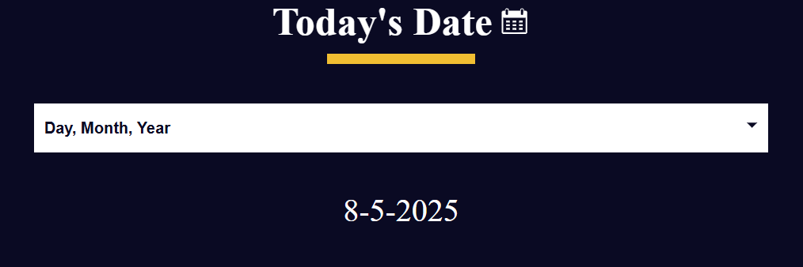

# Date Formatter

A lightweight web app to parse and display dates in multiple formats. Enter any date string or use the current date to instantly see formatted outputs.

## Features

- **Custom Date Input**: Type or paste any valid date string (e.g. `2025-05-08`, `May 8, 2025`, `08/05/2025`)  
- **Preset Formats**: View the date in ISO (`YYYY-MM-DD`), US (`MM/DD/YYYY`), EU (`DD-MM-YYYY`), full month name, and Unix timestamp  
- **Live Preview**: See formatted results update as you type  
- **Clear & Reset**: One-click button to clear input and outputs  
- **Validation**: Alerts you if the entered date is invalid  

## Demo

Open `index.html` in your browser or view the live demo:  
<https://github.com/sadykovIsmail/Java-script/tree/main/09-date-formatter>



## Installation

_No build tools or external dependencies required!_

1. Clone this repository:  
   ```bash
   git clone https://github.com/sadykovIsmail/Java-script/tree/main/09-date-formatter
Open index.html in any modern web browser.

Usage
In the Date Input field, type or paste your date.

Select one of the Preset Formats from the dropdown (or leave on default).

View the formatted output in the Results area.

Click Clear to reset the form.

Tech Stack
HTML5 for structure

CSS3 for styling and responsive design

Vanilla JavaScript (ES6+) for date parsing and formatting

File Structure
date-formatter/
├── index.html           # Main HTML page with inline form
├── css/
│   └── styles.css       # App styles
├── js/
│   └── script.js           # Parsing & formatting logic
└── README.md            # Project documentation
Contributing
1) Fork the repo

2) Create a new branch:
git checkout -b feature/<your-branch-name>

3) Commit your changes:
git commit -m "Add awesome feature"

4) Push to the branch:
git push -u origin feature/<your-branch-name>

5) Open a Pull Request