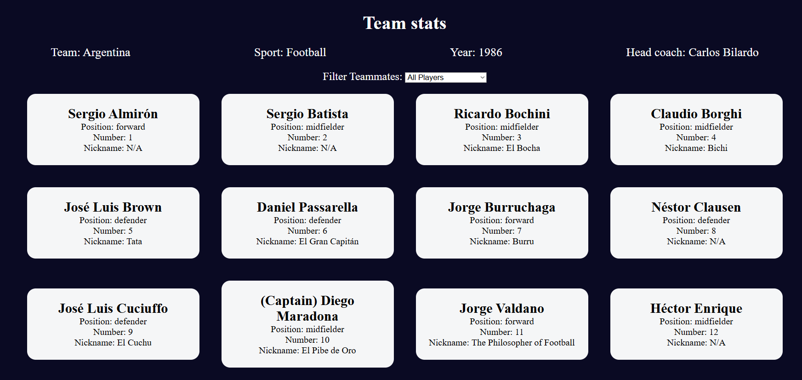

# Football Team Cards

A responsive web app that displays information about football (soccer) teams using interactive cards. Browse, search, and sort your favorite clubs with ease.

## Features

- **Team Cards**: Displays each club’s logo, name, and country in a card layout  
- **Search Filter**: Filter teams by name in real time  
- **Sort Options**: Sort cards alphabetically or by country  
- **Card Flip**: Click a card to reveal additional details (foundation year, stadium) on its back  
- **Responsive Grid**: Adapts from mobile to desktop layouts  

## Demo

Open `index.html` in your browser or view the live demo:  
<https://sadykovismail.github.io/Java-script/10-football-team-cards>



## Installation

_No build tools or dependencies required!_

1. Clone this repository:  
   ```bash
   git clone https://github.com/sadykovIsmail/Java-script/tree/main/10-football-team-cards
Open index.html in any modern web browser.

Usage
Browse the grid of team cards on load.

Use the Search input to filter teams by name.

Select a Sort option (A–Z or by country).

Click any card to flip it and view more details.

Refresh the page to reset filters and sorting.

Tech Stack
HTML5 for markup

CSS3 (Flexbox & Grid) for styling and layout

Vanilla JavaScript (ES6+) for card rendering, search, sort, and flip interactions

File Structure

football-team-cards/
├── index.html             # Main HTML page
├── css/
│   └── styles.css         # App styles
├── js/
│   └── script.js           # Data array of teams
│
└── README.md              # Project documentation

Contributing
1) Fork the repo

2) Create a new branch:
git checkout -b feature/<your-branch-name>

3) Commit your changes:
git commit -m "Add awesome feature"

4) Push to the branch:
git push -u origin feature/<your-branch-name>

5) Open a Pull Request