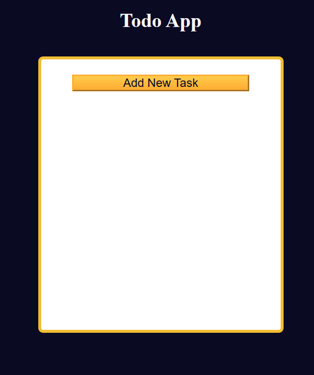

# Todo App

A clean, responsive web application to manage your daily tasks. Add, complete, edit, and remove to-dos—all in your browser.

## Features

- **Add Task**: Enter a new task and click **Add** to append it to your list  
- **Mark Complete**: Click the checkbox next to a task to mark it as done (strikethrough style)  
- **Edit Task**: Click the ✏️ icon to update task text in place  
- **Delete Task**: Click the 🗑️ icon to remove any task  
- **Persistent Storage**: All tasks are saved in `localStorage` so they persist on refresh  
- **Clear All**: One-click button to clear the entire list  

## Demo

Open `index.html` in your browser or view the live demo:  
<https://sadykovismail.github.io/Java-script/11-todo-app/>



## Installation

_No build tools or external dependencies required!_

1. Clone this repository:  
   ```bash
   git clone https://github.com/sadykovIsmail/Java-script/tree/main/11-todo-app
Open index.html in any modern web browser.

Usage
Type your task into the New Task input field.

Click Add (or press Enter) to add it to your list.

Toggle the checkbox to mark tasks as complete or incomplete.

Click the ✏️ icon to edit a task, then save.

Click the 🗑️ icon to delete a task.

Use Clear All to remove every task at once.

Tech Stack
HTML5 for structure

CSS3 for styling and responsive design

Vanilla JavaScript (ES6+) for task management and localStorage integration

File Structure

todo-app/
├── index.html           # Main HTML page
├── css/
│   └── styles.css       # App styles
├── js/
│   └── script.js           # Task logic and storage
└── README.md            # Project documentation

Contributing
1) Fork the repo

2) Create a new branch:
git checkout -b feature/<your-branch-name>

3) Commit your changes:
git commit -m "Add awesome feature"

4) Push to the branch:
git push -u origin feature/<your-branch-name>

5) Open a Pull Request