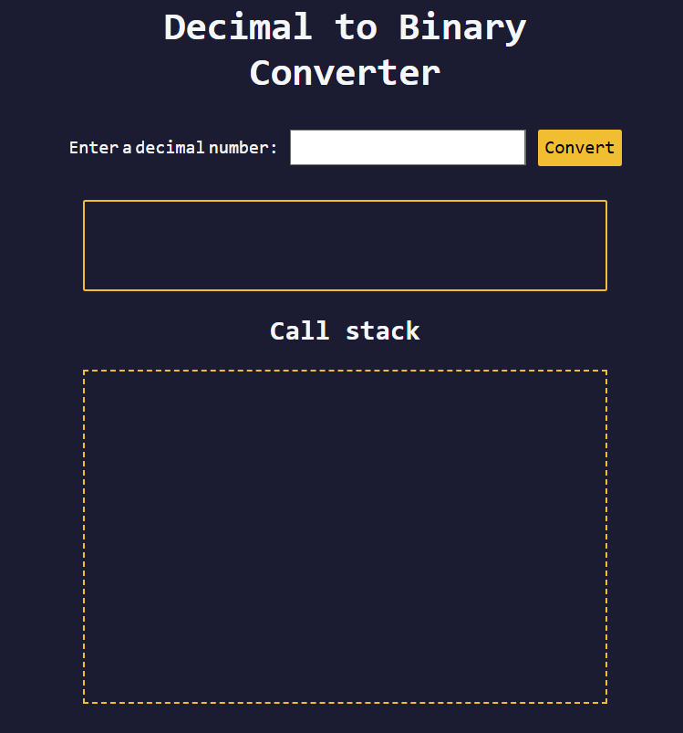

# Decimal to Binary Converter

A simple web app to convert decimal numbers into their binary equivalents. Enter any non-negative integer and see the real-time binary output.

## Features

- **Decimal Input**: Type any non-negative integer  
- **Instant Conversion**: Click **Convert** (or press Enter) to get the binary result  
- **Input Validation**: Alerts you if the input is empty or not a valid non-negative integer  
- **Clear & Reset**: One-click button to clear both input and output  
- **Responsive Design**: Works on desktop and mobile browsers  

## Demo

Open `index.html` in your browser or view the live demo:  
<https://sadykovismail.github.io/Java-script/12-decimal-to-binary-converter/>



## Installation

_No build tools or external dependencies required!_

1. Clone this repository:  
   ```bash
   git clone https://github.com/sadykovIsmail/Java-script/tree/main/12-decimal-to-binary-converter
Open index.html in any modern web browser.

## Usage
In the Decimal Number field, type a non-negative integer (e.g. 42).

Click the Convert button (or press Enter).

View the Binary Result below the input.

Click Clear to reset the input and output fields.

## Tech Stack
HTML5 for markup

CSS3 for styling and responsive layout

Vanilla JavaScript (ES6+) for conversion logic and DOM updates

## File Structure

decimal-to-binary-converter/
├── index.html           # Main HTML page
├── css/
│   └── styles.css       # App styles
├── js/
│   └── script.js           # Conversion logic and UI handlers
└── README.md            # Project documentation

## Contributing
1) Fork the repo

2) Create a new branch:
git checkout -b feature/<your-branch-name>

3) Commit your changes:
git commit -m "Add awesome feature"

4) Push to the branch:
git push -u origin feature/<your-branch-name>

5) Open a Pull Request