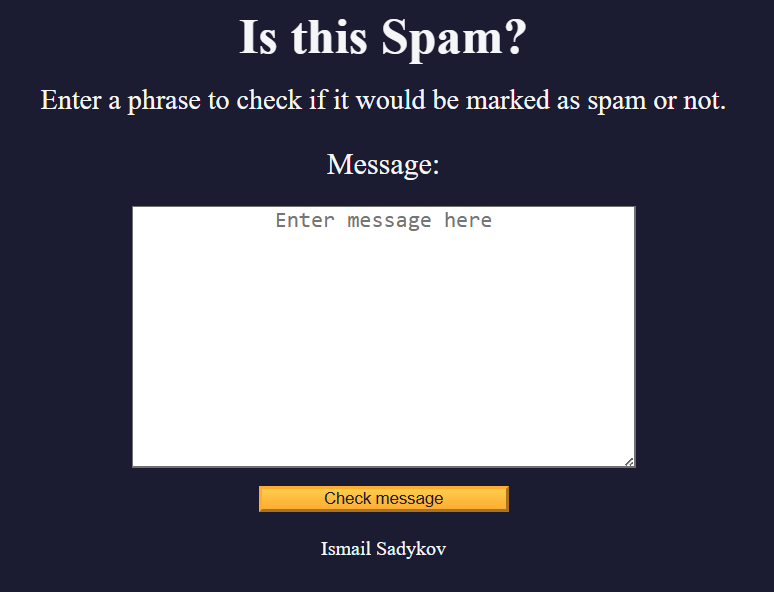

# Spam Filter

A lightweight web app to detect whether a given message is spam or not. Simply paste your text and let the built-in algorithm classify it instantly.

## Features

- **Message Input**: Paste any text or email content into the input area  
- **Spam Classification**: Click **Analyze** to see “Spam” or “Not Spam” based on keyword frequency  
- **Spam Score**: View a numeric score representing the likelihood of spam  
- **Keyword Highlighting**: Highlights common spam words in the input text  
- **Clear & Reset**: One-click button to clear input and results  
- **Responsive Layout**: Works on mobile and desktop screens  

## Demo

Open `index.html` in your browser or view the live demo:  
<https://sadykovismail.github.io/Java-script/13-spam-filter/>



## Installation

_No build tools or external dependencies required!_

1. Clone this repository:
   ```bash
   git clone https://github.com/sadykovIsmail/Java-script/tree/main/13-spam-filter
Open index.html in any modern web browser.

Usage
Paste your message into the Message textarea.

Click the Analyze button (or press Enter).

View the classification result and spam score below.

See common spam keywords highlighted in your text.

Click Clear to reset the form and results.

Tech Stack
HTML5 for markup

CSS3 for styling and responsive design

Vanilla JavaScript (ES6+) for classification logic and DOM updates

File Structure

spam-filter/
├── index.html           # Main HTML page
├── css/
│   └── styles.css       # App styles
├── js/
│   └── script.js           # Spam detection logic
└── README.md            # Project documentation

Contributing
1) Fork the repo

2) Create a new branch:
git checkout -b feature/<your-branch-name>

3) Commit your changes:
git commit -m "Add awesome feature"

4) Push to the branch:
git push -u origin feature/<your-branch-name>

5) Open a Pull Request