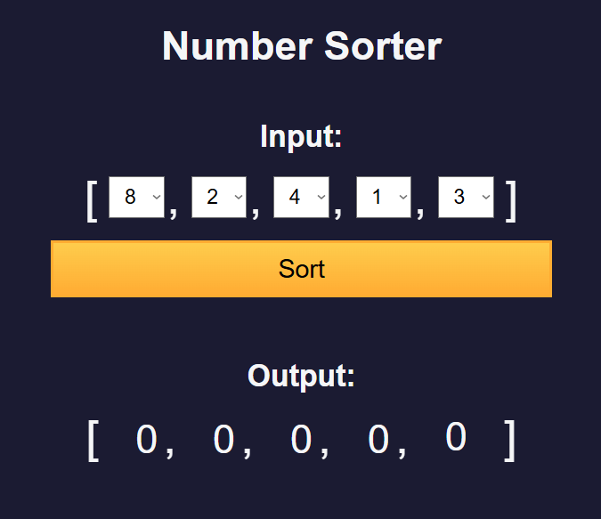

# Number Sorter

A web app to quickly sort a list of numbers. Enter your numbers and instantly see them ordered ascending or descending.

## Features

- **Number Input**: Enter a comma- or space-separated list of numbers  
- **Sort Ascending**: Click **Sort Ascending** to order from smallest to largest  
- **Sort Descending**: Click **Sort Descending** to order from largest to smallest  
- **Input Validation**: Ignores non-numeric entries and alerts on empty input  
- **Clear & Reset**: One-click button to clear both input and output  
- **Responsive Design**: Works on both desktop and mobile  

## Demo

Open `index.html` in your browser or view the live demo:  
<https://sadykovismail.github.io/Java-script/14-number-sorter/>



## Installation

_No build tools or external dependencies required!_

1. Clone this repository:  
   ```bash
   git clone https://github.com/sadykovIsmail/Java-script/tree/main/14-number-sorter
Open index.html in any modern web browser.

## Usage
Enter your list of numbers in the Number List field (e.g. 5, 2, 9, 1, 7).

Click Sort Ascending or Sort Descending.

View the sorted result in the Output area.

Click Clear to reset the fields.

## Tech Stack
HTML5 for structure

CSS3 for styling and responsive layout

Vanilla JavaScript (ES6+) for parsing, sorting logic, and DOM updates

## File Structure
number-sorter/
├── index.html           # Main HTML page
├── css/
│   └── styles.css       # App styles
├── js/
│   └── script.js           # Sorting logic and UI handlers
└── README.md            # Project documentation

## Contributing
1) Fork the repo

2) Create a new branch:
git checkout -b feature/<your-branch-name>

3) Commit your changes:
git commit -m "Add awesome feature"

4) Push to the branch:
git push -u origin feature/<your-branch-name>

5) Open a Pull Request