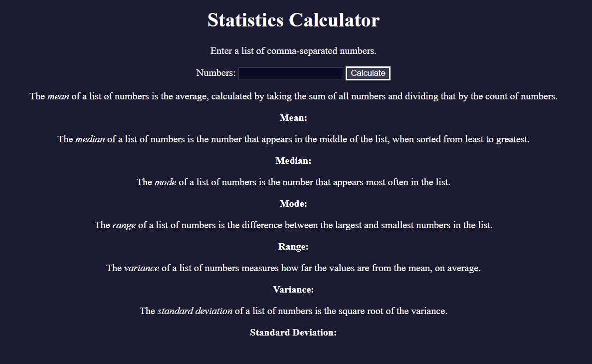

# Statistic Calculator

A lightweight web app to compute common statistical measures from a dataset. Enter your numbers and instantly see mean, median, mode, range, variance, and standard deviation.

## Features

- **Data Input**: Enter a comma- or space-separated list of numbers  
- **Mean**: Calculates the arithmetic average  
- **Median**: Finds the middle value in the sorted list  
- **Mode**: Identifies the most frequently occurring number(s)  
- **Range**: Computes the difference between max and min values  
- **Variance**: Measures how spread out the numbers are  
- **Standard Deviation**: Calculates the square root of the variance  
- **Clear & Reset**: One-click button to clear input and all outputs  
- **Input Validation**: Alerts if input is empty or contains invalid entries  
- **Responsive Design**: Works seamlessly on desktop and mobile  

## Demo

Open `index.html` in your browser or view the live demo:  
<https://sadykovismail.github.io/Java-script/15-statistic-calculator/>



## Installation

_No build tools or external dependencies required!_

1. Clone this repository:  
   ```bash
   git clone https://github.com/sadykovIsmail/Java-script/tree/main/15-statistic-calculator
Open index.html in any modern web browser.

## Usage
In the Data Input field, type your numbers (e.g. 4, 8, 15, 16, 23, 42).

Click Calculate (or press Enter).

View each statistic in the Results section:

Mean

Median

Mode

Range

Variance

Standard Deviation

Click Clear to reset the form and results.

## Tech Stack
HTML5 for markup

CSS3 for styling and responsive layout

Vanilla JavaScript (ES6+) for calculation logic and DOM manipulation

## File Structure

statistic-calculator/
├── index.html           # Main HTML page
├── css/
│   └── styles.css       # App styles
├── js/
│   └── script.js           # Calculation logic and UI handlers
└── README.md            # Project documentation

## Contributing
1) Fork the repo

2) Create a new branch:
git checkout -b feature/<your-branch-name>

3) Commit your changes:
git commit -m "Add awesome feature"

4) Push to the branch:
git push -u origin feature/<your-branch-name>

5) Open a Pull Request