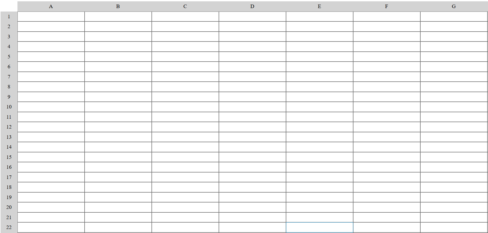

# Spreadsheet App

A lightweight web-based spreadsheet for basic data entry, calculations, and CSV import/export—all in your browser.

## Features

- **Editable Grid**: Click any cell to enter or edit data  
- **Add/Remove Rows & Columns**: Dynamically insert or delete rows and columns  
- **Basic Formulas**: Support for `SUM`, `AVERAGE`, `MIN`, `MAX`—just start a cell with `=` (e.g. `=SUM(A1:A5)`)  
- **CSV Import/Export**: Load data from CSV files and download your sheet as a CSV  
- **Cell Formatting**: Apply bold, italic, or background colors to selected cells  
- **Persistent Storage**: Automatically saves your sheet in `localStorage` so nothing is lost on refresh  
- **Keyboard Navigation**: Use arrow keys, Enter, and Tab to move between cells  
- **Responsive Design**: Works on desktop and tablet layouts  

## Demo

Open `index.html` in your browser or view the live demo:  
<https://sadykovismail.github.io/Java-script/16-spread-sheet/>



## Installation

_No build tools or external dependencies required!_

1. Clone this repository:  
   ```bash
   git clone https://github.com/sadykovIsmail/Java-script/tree/main/16-spread-sheet
Open index.html in any modern web browser.

## Usage
Edit Cells: Click a cell, type your data or formula (= prefix), and press Enter.

Navigate: Use arrow keys, Enter, and Tab to move between cells.

Add/Remove: Click the “+” or “–” icons in the row/column headers to insert or delete.

Format: Select one or more cells and click the Bold, Italic, or Fill Color buttons.

Import CSV: Click Import, choose a .csv file, and your data will populate the sheet.

Export CSV: Click Export to download the current sheet as a CSV file.

Save: Your work is auto-saved in localStorage. To start fresh, click Clear Sheet.

## Tech Stack
HTML5 for structure

CSS3 for styling and responsive layout

Vanilla JavaScript (ES6+) for grid management, formula parsing, and storage

## File Structure

spreadsheet-app/
├── index.html           # Main HTML page with embedded toolbar
├── css/
│   └── styles.css       # App styles
├── js/
│   ├── script.js           # Core grid & UI logic
│
└── README.md            # Project documentation

## Contributing
1) Fork the repo

2) Create a new branch:
git checkout -b feature/<your-branch-name>

3) Commit your changes:
git commit -m "Add awesome feature"

4) Push to the branch:
git push -u origin feature/<your-branch-name>

5) Open a Pull Request