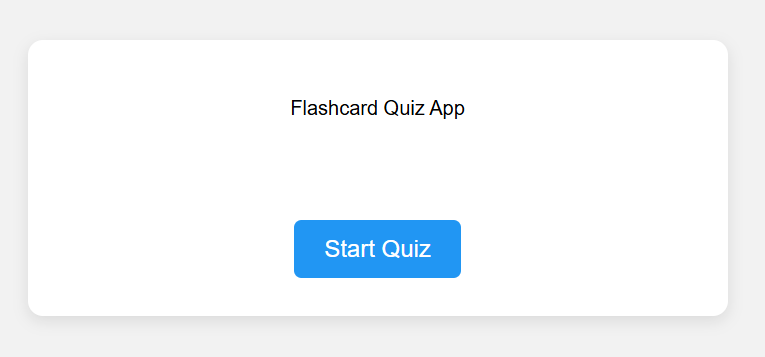

# Flash Card Quiz

A web app for creating and studying flashcard quizzes. Perfect for self-testing vocabulary, formulas, or any Q&A pairs.

## Features

- **Create Flashcards**: Add question–answer pairs on the fly  
- **Quiz Mode**: Flip through cards and try to answer before revealing  
- **Reveal Answer**: Click **Show Answer** to check yourself  
- **Score Tracking**: Mark each card as “Correct” or “Incorrect” and see your total score  
- **Categories**: Group cards by topic or subject  
- **Persistent Storage**: Saves your flashcards in `localStorage` so you never lose progress  
- **Clear & Reset**: Remove all cards or reset scores with one click  
- **Responsive Design**: Works across desktop and mobile  

## Demo

Open `index.html` in your browser or view the live demo:  
<https://sadykovismail.github.io/Java-script/18-flashcard-quiz/>



## Installation

_No build tools or external dependencies required!_

1. Clone this repository:  
   ```bash
   git clone https://github.com/sadykovIsmail/Java-script/tree/main/18-flashcard-quiz
Open index.html in any modern web browser.

## Usage
Add Cards: Enter a question in the Front field and the answer in the Back field, then click Add Card.

Start Quiz: Click Quiz Mode to begin reviewing cards.

Answer: Think of your answer, then click Show Answer to reveal.

Score: Click Correct or Incorrect to record your response.

Review: Navigate between cards using Next and Previous.

Categories: Use the dropdown to filter cards by category.

Reset: Click Clear All Cards or Reset Scores to start over.

## Tech Stack
HTML5 for structure

CSS3 for styling and responsive layout

Vanilla JavaScript (ES6+) for card management, quiz logic, and localStorage integration

## File Structure
flash-card-quiz/
├── index.html            # Main HTML page
├── css/
│   └── styles.css        # App styles
├── js/
│   └── script.js            # Flashcard & quiz logic
└── README.md             # Project documentation

## Contributing
1) Fork the repo

2) Create a new branch:
git checkout -b feature/<your-branch-name>

3) Commit your changes:
git commit -m "Add awesome feature"

4) Push to the branch:
git push -u origin feature/<your-branch-name>

5) Open a Pull Request