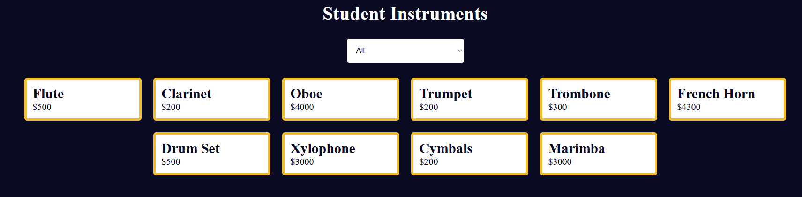

# Music Instrument Filter

A web app to browse and filter a list of musical instruments by category, making it easy to find exactly what you’re looking for.

## Features

- **Category Filter**: Filter instruments by type (Strings, Percussion, Woodwind, Brass, Keyboard)  
- **Search Bar**: Real-time search to find instruments by name  
- **Instrument Cards**: Displays image, name, and brief description  
- **Responsive Layout**: Adapts seamlessly from mobile to desktop  
- **No External Libraries**: Built with plain HTML, CSS, and JavaScript  

## Demo

Open `index.html` in your browser or view the live demo:  
<http://127.0.0.1:5500/20-music-instrument-filter/index.html>



## Installation

_No build tools or external dependencies required!_

1. Clone this repository:  
   ```bash
   git clone https://github.com/sadykovIsmail/Java-script/tree/main/20-music-instrument-filter
Open index.html in any modern web browser.

Usage
Use the Search input at the top to type any part of an instrument’s name.

Select one or more Category checkboxes to narrow results.

Instrument cards update instantly to match your criteria.

Click on a card to view more details (if implemented).

To clear filters, empty the search field and uncheck all categories.

Tech Stack
HTML5 for markup

CSS3 (Flexbox & Grid) for styling and layout

Vanilla JavaScript (ES6+) for filtering logic and DOM updates

File Structure

music-instrument-filter/
├── index.html             # Main HTML page
├── css/
│   └── style.css         # App styles
├── js/
│   └── script.js             # Filter & search logic
├
└── README.md              # Project documentation

Contributing
1) Fork the repo

2) Create a new branch:
git checkout -b feature/<your-branch-name>

3) Commit your changes:
git commit -m "Add awesome feature"

4) Push to the branch:
git push -u origin feature/<your-branch-name>

5) Open a Pull Request