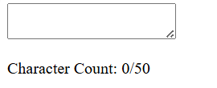

# Real Time Counter

A single-file web app that displays a live, automatically incrementing counter in your browser. All HTML, CSS, and JavaScript are contained in one `index.html`.

## Features

- **Live Counting**: Counter value increments by 1 every second  
- **Reset Button**: Click **Reset** to set the counter back to 0  
- **Single File**: Everything (markup, styles, and script) lives in `index.html` for easy portability  

## Demo

Open `index.html` in your browser or view the live demo:  
<https://sadykovismail.github.io/Java-script/21-real-time-counter/>



## Installation

_No build or external dependencies required!_

1. Clone this repository:  
   ```bash
   git clone https://github.com/sadykovIsmail/Java-script/tree/main/21-real-time-counter
Open index.html in any modern web browser.

## Usage
- On load, the counter starts at 0 and increments every second.

- Click the Reset button at any time to set the counter back to 0.

- To restart counting from zero on page reload, simply refresh the page.

## Tech Stack
- HTML5 for structure

- CSS3 (inline) for basic styling

- Vanilla JavaScript (inline in index.html) using setInterval for real-time updates

## File Structure

real-time-counter/
└── index.html    # All markup, styling, and script in one file
## Contributing
1) Fork the repo

2) Create a new branch:
git checkout -b feature/<your-branch-name>

3) Commit your changes:
git commit -m "Add awesome feature"

4) Push to the branch:
git push -u origin feature/<your-branch-name>

5) Open a Pull Request