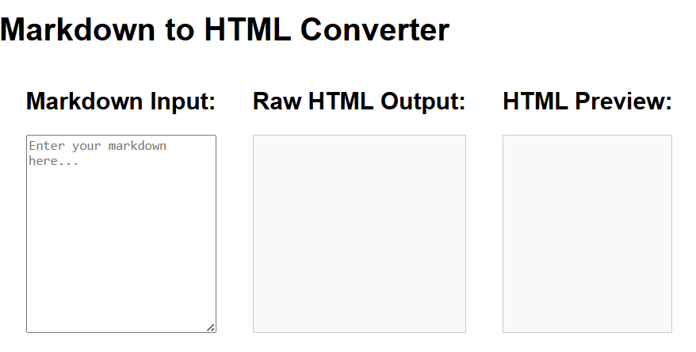

# Markdown to HTML Converter

A web app that converts Markdown text into formatted HTML in real time. Perfect for previewing your notes, documentation, or blog posts before publishing.

## Features

- **Live Preview**: Type Markdown in the input area and see the rendered HTML update instantly  
- **Common Syntax Support**: Headers, lists, bold/italic, code blocks, links, images, blockquotes, and more  
- **Copy HTML**: One-click button to copy the generated HTML to your clipboard  
- **Clear & Reset**: Button to clear both input and output areas  
- **Responsive Design**: Works well on desktop and mobile screens  

## Demo

Open `index.html` in your browser or view the live demo:  
<https://sadykovismail.github.io/Java-script/22-markdown-to-html-converter/>



## Installation

_No build tools or external dependencies required!_

1. Clone this repository:  
   ```bash
   git clone https://github.com/sadykovIsmail/Java-script/tree/main/22-markdown-to-html-converter
Open index.html in any modern web browser.

## Usage
- In the Markdown Input area, type or paste your Markdown text.

- As you type, the HTML Preview area on the right updates automatically.

- Click Copy HTML to copy the rendered HTML to your clipboard.

- Click Clear to reset both the input and preview fields.

## Tech Stack
- HTML5 for structure

- CSS3 for styling and responsive layout

- Vanilla JavaScript (ES6+) for parsing Markdown and updating the DOM

- marked.js (optional) for robust Markdown parsing

## File Structure

markdown-to-html-converter/
├── index.html                  # Main HTML page with input & preview areas
├── css/
│   └── styles.css              # App styles
├── js/
│   ├── script.js                  # Core logic
|
└── README.md                   # Project documentation

## Contributing
1) Fork the repo

2) Create a new branch:
git checkout -b feature/<your-branch-name>

3) Commit your changes:
git commit -m "Add awesome feature"

4) Push to the branch:
git push -u origin feature/<your-branch-name>

5) Open a Pull Request