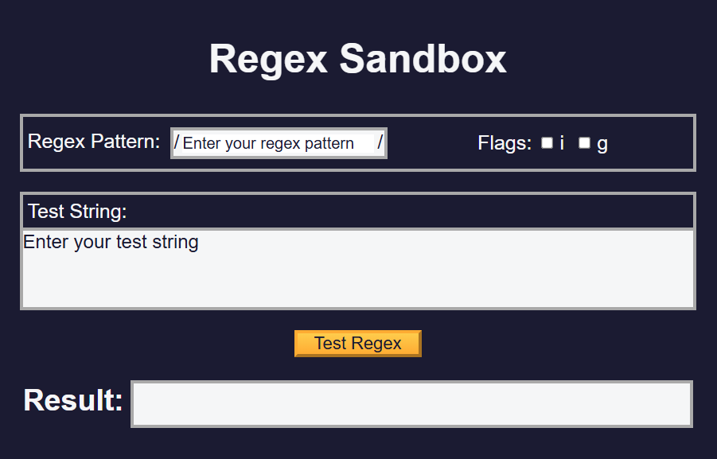

# Regex Sandbox

An interactive web app to test and debug regular expressions. Enter a pattern and test string, adjust flags, and see matches highlighted in real time.

## Features

- **Regex Input**: Enter any JavaScript-style regex pattern (without the enclosing slashes)  
- **Flags Selector**: Toggle `g`, `i`, `m`, `u`, `s`, and `y` flags  
- **Test String**: Paste or type your input text to test against the pattern  
- **Live Highlighting**: Matches are highlighted as you type or change flags  
- **Match List**: Displays an array of all matches and capture groups  
- **Error Feedback**: Shows syntax errors for invalid patterns  
- **Clear & Reset**: Buttons to clear pattern, flags, and test string  
- **Responsive Design**: Works well on desktop and mobile  

## Demo

Open `index.html` in your browser or view the live demo:  
<https://sadykovismail.github.io/Java-script/23-regex-sandbox/>



## Installation

_No build tools or external dependencies required!_

1. Clone this repository:  
   ```bash
   git clone https://github.com/sadykovIsmail/Java-script/tree/main/23-regex-sandbox
Open index.html in any modern web browser.

## Usage
In the Pattern field, type your regex (e.g. \b\w+\b).

Check or uncheck the Flags you want (e.g. g for global).

In the Test String area, enter the text you want to search.

Matches will be highlighted instantly in the test text.

Scroll down to see a list of all matches and any capture groups.

Click Clear Pattern or Clear Text to reset fields.

## Tech Stack
HTML5 for structure

CSS3 for styling and responsive layout

Vanilla JavaScript (ES6+) for regex evaluation, highlighting, and DOM updates

## File Structure

regex-sandbox/
├── index.html           # Main HTML page
├── css/
│   └── styles.css       # App styles
├── js/
│   └── script.js           # Regex logic and UI handlers
└── README.md            # Project documentation

## Contributing
1) Fork the repo

2) Create a new branch:
git checkout -b feature/<your-branch-name>

3) Commit your changes:
git commit -m "Add awesome feature"

4) Push to the branch:
git push -u origin feature/<your-branch-name>

5) Open a Pull Request