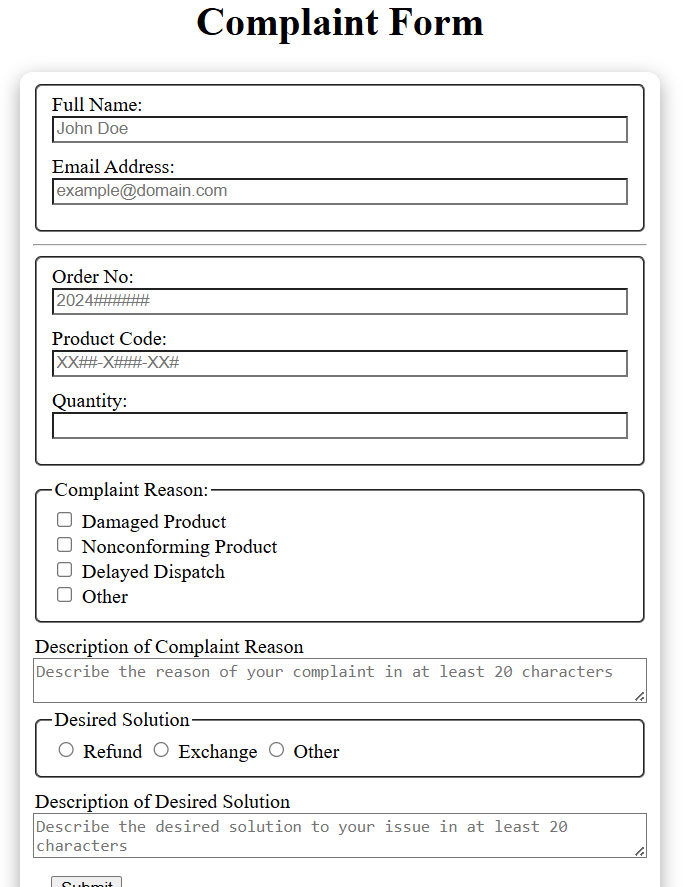

# Customer Complaint Form

A web-based form to submit and validate customer complaints. Uses regex for client-side validation and provides instant feedback.

## Features

- **Name Validation**: Ensures at least two alphabetic words  
- **Email Validation**: Checks proper email format with regex  
- **Phone Number Validation**: Supports formats like `(123) 456-7890`, `123-456-7890`, `+1 123 456 7890`  
- **Complaint Message**: Requires a minimum length and displays character count  
- **Live Feedback**: Highlights invalid fields and shows error messages in real time  
- **Reset & Clear**: Clear the form with one click  
- **Responsive Design**: Mobile- and desktop-friendly layout

## Demo

Open `index.html` in your browser or view the live demo:  
<http://127.0.0.1:5500/24-customer-complaint-form/index.html>



## Installation

_No build tools or external dependencies required!_

1. Clone this repository:  
   ```bash
   git clone https://github.com/sadykovIsmail/Java-script/tree/main/24-customer-complaint-form
Open index.html in any modern web browser.

Usage
Fill in Name, Email, Phone Number, and Complaint Message.

As you type, invalid input fields will be highlighted with red borders and error text.

Character count updates below the Complaint Message field.

Click Submit to see a success alert if all fields are valid.

Click Reset to clear all fields and error messages.

Tech Stack
HTML5 for structure

CSS3 for styling and responsive layout

Vanilla JavaScript (ES6+) for regex-based validation and DOM manipulation

File Structure

customer-complaint-form/
├── index.html           # Main HTML page with embedded form
├── css/
│   └── styles.css       # Form styles and layout
├── js/
│   └── app.js           # Validation logic using regex
└── README.md            # Project documentation

Contributing
1) Fork the repo

2) Create a new branch:
git checkout -b feature/<your-branch-name>

3) Commit your changes:
git commit -m "Add awesome feature"

4) Push to the branch:
git push -u origin feature/<your-branch-name>

5) Open a Pull Request