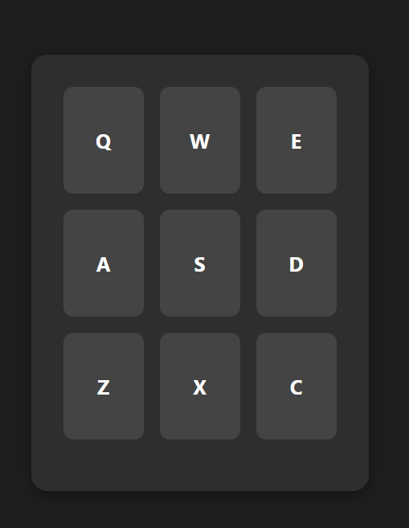

# Drum Machine

A browser-based drum machine that lets you play beats, record loops, and experiment with different percussion sounds—all in real time.

## Features

- **Drum Pads**: Click or press mapped keys (e.g. Q, W, E, A, S, D, Z, X, C) to play different drum sounds  
- **Visual Feedback**: Pads light up when triggered, providing real-time feedback  
- **Volume Control**: Adjust the master volume with a slider  
- **Loop Recording**: Record a sequence of pad hits and play it back in a continuous loop  
- **Clear/Stop**: Clear the current loop or stop playback with a single click  
- **Responsive Layout**: Works on desktop and mobile screens  

## Demo

Open `index.html` in your browser or view the live demo:  
<https://sadykovismail.github.io/Java-script/25-drum-machine>



## Installation

_No build tools or external dependencies required!_

1. Clone this repository:  
   ```bash
   git clone https://github.com/sadykovIsmail/Java-script/tree/main/25-drum-machine
Open index.html in any modern web browser.

## Usage
Click any drum pad or press its corresponding keyboard key (Q, W, E, A, S, D, Z, X, C) to play a sound.

Adjust the Volume slider to control the overall volume.

Click Record to start capturing your pad hits.

Click Stop to end recording and automatically begin looping your sequence.

Click Clear to erase the recorded loop and start fresh.

## Tech Stack
HTML5 for structure

CSS3 for styling and responsive layout

Vanilla JavaScript (ES6+) for audio playback, recording logic, and event handling

Web Audio API for low-latency sound playback

## File Structure

drum-machine/
├── index.html           # Main HTML page
├── css/
│   └── styles.css       # App styles
├── js/
│   └── script.js        # Drum pad logic, recordingplayback
└── README.md            # Project documentation

## Contributing
1) Fork the repo

2) Create a new branch:
git checkout -b feature/<your-branch-name>

3) Commit your changes:
git commit -m "Add awesome feature"

4) Push to the branch:
git push -u origin feature/<your-branch-name>

5) Open a Pull Request