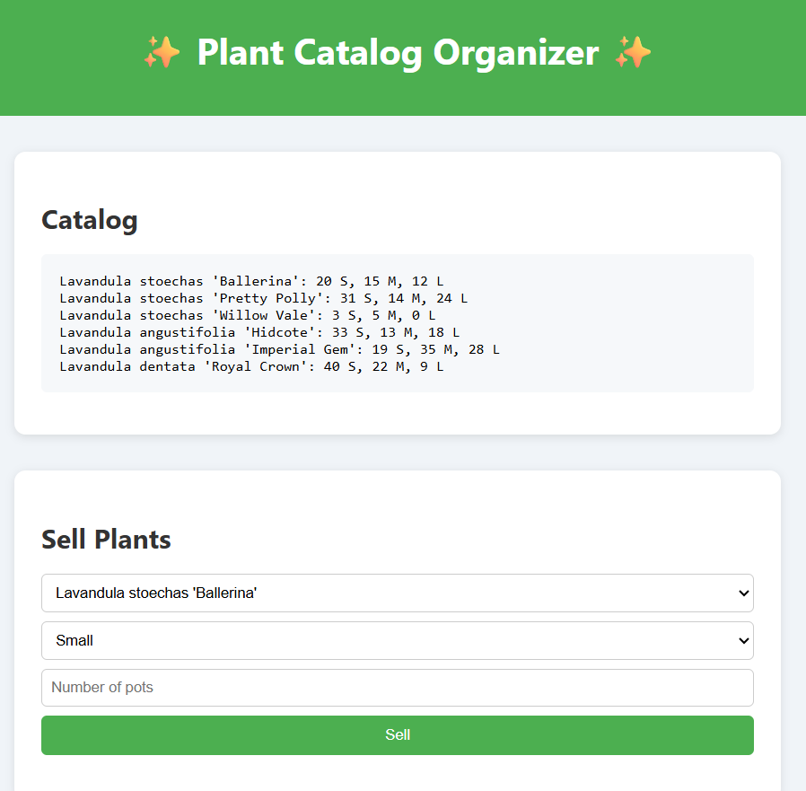

# Plant Nursery Catalog

A web app to browse and manage a catalog of plants for your nursery. View plant details, filter by category, and organize your green inventory.

## Features

- **Plant Cards**: Displays each plant’s image, common name, and scientific name  
- **Category Filter**: Filter plants by type (e.g. Succulents, Ferns, Flowering)  
- **Search Bar**: Real-time search by common or scientific name  
- **Detail View**: Click a card to see watering/lighting requirements and description  
- **Add New Plant**: Fill out a simple form to add new plants to the catalog  
- **Responsive Layout**: Works on desktop and mobile screens  

## Demo

Open `index.html` in your browser or view the live demo:  
<http://127.0.0.1:5500/27-plant-nursery-catalog/index.html  />



## Installation

_No build tools or external dependencies required!_

1. Clone this repository:  
   ```bash
   git clone https://github.com/sadykovIsmail/Java-script/tree/main/27-plant-nursery-catalog
Open index.html in any modern web browser.

Usage
Browse the grid of plant cards on load.

Use the Search input to filter by name.

Select a Category from the dropdown to narrow results.

Click a plant card to view its full details.

To add a new plant, click Add Plant, fill in the form, and submit.

Refresh to reset search and filters.

Tech Stack
HTML5 for markup

CSS3 for styling and responsive design

Vanilla JavaScript (ES6+) for filtering, form handling, and DOM updates

File Structure

plant-nursery-catalog/
├── index.html             # Main HTML page
├── css/
│   └── styles.css         # App styles
├── js/
│   └── script.js          # Catalog logic and UI handlers
└── README.md              # Project documentation

Contributing
1) Fork the repo

2) Create a new branch:
git checkout -b feature/<your-branch-name>

3) Commit your changes:
git commit -m "Add awesome feature"

4) Push to the branch:
git push -u origin feature/<your-branch-name>

5) Open a Pull Request