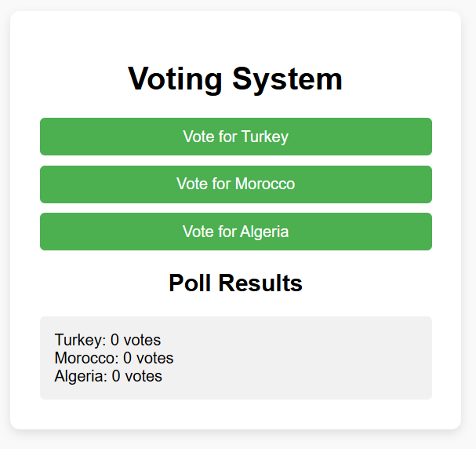

# Voting System

A simple web app that lets users vote on options and view live results. Perfect for polls, surveys, or classroom quizzes.

## Features

- **Add Options**: Admin can define poll options via a form  
- **Cast Vote**: Click an option button to cast a vote  
- **Live Tally**: See vote counts update in real time  
- **Prevent Double Voting**: Uses `localStorage` to block repeat votes per browser  
- **Reset Poll**: Admin can clear all votes and start a new poll  
- **Responsive Design**: Works on desktop and mobile devices  

## Demo

Open `index.html` in your browser or view the live demo:  
<http://127.0.0.1:5500/28-voting-system/index.html/>



## Installation

_No build tools or external dependencies required!_

1. Clone this repository:  
   ```bash
   git clone https://github.com/sadykovIsmail/Java-script/tree/main/28-voting-system
Open index.html in any modern web browser.

Usage
Admin Mode:

Click Add Option, enter option text, and click Save to create voting choices.

Click Reset Poll to clear all current votes.

Voting Mode:

Click any option button to cast your vote.

Once voted, you cannot vote again (per browser).

See the live vote counts next to each option.

To start fresh or change options, reset the poll and add new choices.

Tech Stack
HTML5 for structure

CSS3 for styling and responsive layout

Vanilla JavaScript (ES6+) for vote logic, UI updates, and localStorage management

File Structure

voting-system/
├── index.html           # Main HTML page
├── css/
│   └── styles.css       # App styles
├── js/
│   └── script.js           # Voting logic and UI handlers
└── README.md            # Project documentation

Contributing
1) Fork the repo

2) Create a new branch:
git checkout -b feature/<your-branch-name>

3) Commit your changes:
git commit -m "Add awesome feature"

4) Push to the branch:
git push -u origin feature/<your-branch-name>

5) Open a Pull Request