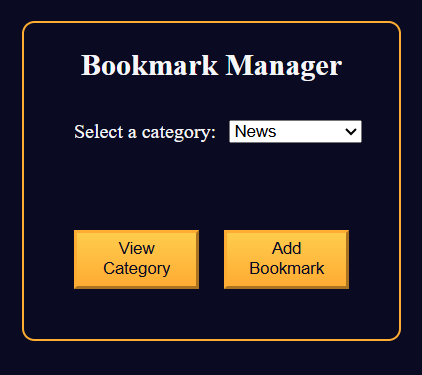

# Bookmark Manager App

A web application to save, organize, and manage your favorite links. Quickly add, categorize, and search through bookmarks—all in your browser.

## Features

- **Add Bookmark**: Enter a URL, title, and optional tags to save a new bookmark  
- **List View**: Displays all saved bookmarks with title, URL, and tags  
- **Search & Filter**: Real-time search by title or tags; filter by tag  
- **Edit & Delete**: Update bookmark details or remove entries at any time  
- **Open in New Tab**: Click a bookmark to open the link in a new browser tab  
- **Persistent Storage**: Bookmarks stored in `localStorage` so they persist on refresh  
- **Responsive Design**: Works seamlessly on desktop and mobile  

## Demo

Open `index.html` in your browser or view the live demo:  
<https://sadykovismail.github.io/Java-script/29-bookmark-manager-app/>



## Installation

_No build tools or external dependencies required!_

1. Clone this repository:  
   ```bash
   git clone https://github.com/sadykovIsmail/Java-script/tree/main/29-bookmark-manager-app
Open index.html in any modern web browser.

Usage
Fill out the Add Bookmark form with the URL, Title, and Tags (comma-separated).

Click Add to save the bookmark.

Use the Search input to filter bookmarks by title or tags.

Click the ✏️ icon next to a bookmark to edit its details, then save.

Click the 🗑️ icon to delete a bookmark.

Click any bookmark title to open it in a new tab.

Tech Stack
HTML5 for structure

CSS3 for styling and responsive layout

Vanilla JavaScript (ES6+) for application logic and localStorage integration

File Structure
pgsql
Копировать
Редактировать
bookmark-manager-app/
├── index.html             # Main HTML page
├── css/
│   └── styles.css         # App styles
├── js/
│   └── script.js             # Core logic: add/edit/delete/search/filter
└── README.md              # Project documentation

Contributing
1) Fork the repo

2) Create a new branch:
git checkout -b feature/<your-branch-name>

3) Commit your changes:
git commit -m "Add awesome feature"

4) Push to the branch:
git push -u origin feature/<your-branch-name>

5) Open a Pull Request