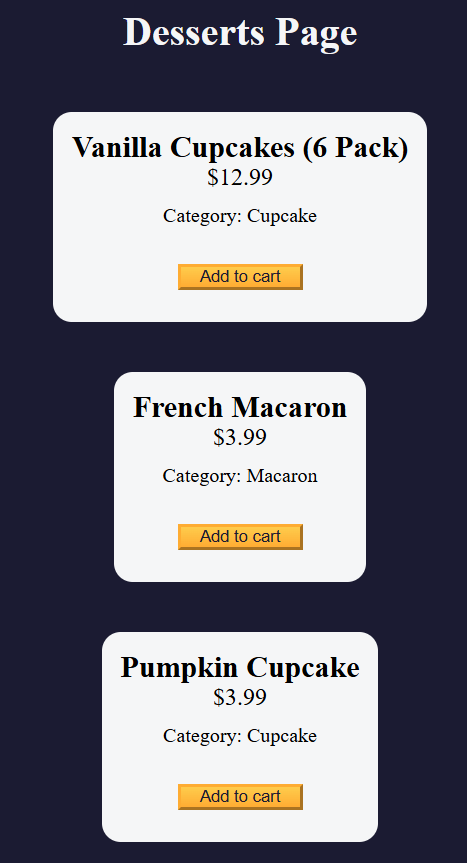

# Shopping Cart

A simple web app to browse products, add items to your cart, and manage quantities— all in your browser without a backend.

## Features

- **Product Listing**: Displays available products with image, name, price, and description  
- **Add to Cart**: Click **Add to Cart** on any product to include it in your shopping cart  
- **Cart View**: See selected items, quantities, individual prices, and subtotal  
- **Quantity Management**: Increase or decrease item quantities directly in the cart  
- **Remove Items**: Click the 🗑️ icon to remove an item entirely  
- **Total Calculation**: Automatically updates cart total as you add/remove/change quantities  
- **Persistent Storage**: Cart contents saved in `localStorage` so they persist on page reload  
- **Responsive Design**: Works seamlessly on mobile and desktop  

## Demo

Open `index.html` in your browser or view the live demo:  
<https://sadykovismail.github.io/Java-script/30-shopping-cart/>



## Installation

_No build tools or external dependencies required!_

1. Clone this repository:  
   ```bash
   git clone https://github.com/sadykovIsmail/Java-script/tree/main/30-shopping-cart
Open index.html in any modern web browser.

## Usage
Browse the Product Listing on load.

Click Add to Cart on any product you wish to purchase.

Click the Cart icon/button to view your selected items.

In the cart, use the + and – buttons to adjust quantities.

Click the 🗑️ icon to remove an item entirely.

View the Total at the bottom.

Refresh or revisit the page to see your cart preserved.

## Tech Stack
HTML5 for structure

CSS3 for styling and responsive layout

Vanilla JavaScript (ES6+) for product rendering, cart logic, and localStorage integration

## File Structure

shopping-cart/
├── index.html           # Main HTML page
├── css/
│   └── styles.css       # App styles
├── js/
│   ├── products.js      # Array of product data
│   └── script.js           # Cart logic and UI handlers
└── README.md            # Project documentation

## Contributing
1) Fork the repo

2) Create a new branch:
git checkout -b feature/<your-branch-name>

3) Commit your changes:
git commit -m "Add awesome feature"

4) Push to the branch:
git push -u origin feature/<your-branch-name>

5) Open a Pull Request