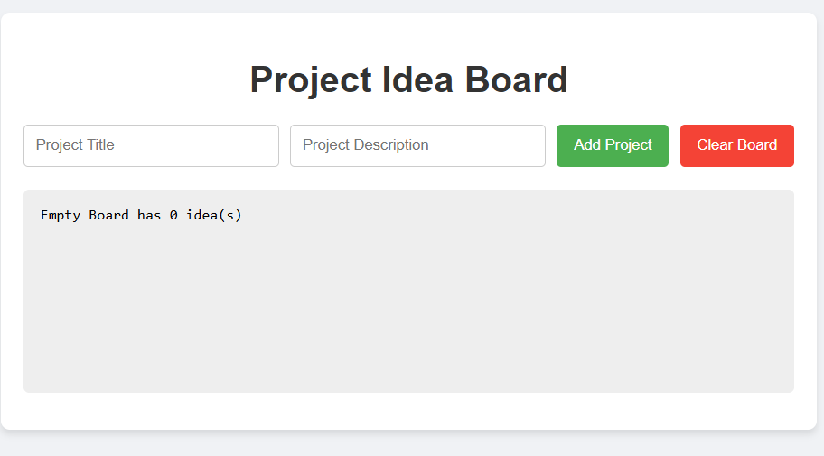

# Project Idea Generator

A fun web app that generates random project ideas to kickstart your next coding adventure. Perfect for overcoming “what should I build next?” moments.

## Features

- **Random Idea Generation**: Click **New Idea** to receive a fresh project suggestion  
- **Categories**: Filter ideas by category (e.g. Web, Mobile, Game, Data, Utility)  
- **Copy to Clipboard**: One-click button to copy the idea text for easy sharing or note-taking  
- **Save Favorites**: Mark ideas as favorites and view them in a dedicated list  
- **Reset Favorites**: Clear your favorites list with one click  
- **Responsive Design**: Works seamlessly on desktop and mobile  

## Demo

Open `index.html` in your browser or view the live demo:  
<https://sadykovismail.github.io/Java-script/31-project-idea/>



## Installation

_No build tools or external dependencies required!_

1. Clone this repository:
   ```bash
   git clone https://github.com/sadykovIsmail/Java-script/tree/main/31-project-idea
Open index.html in any modern web browser.

Usage
Click the New Idea button to generate a project suggestion.

Use the Category dropdown to limit ideas to a specific domain.

Click Copy to copy the suggestion to your clipboard.

Click the ⭐ icon to add the idea to your Favorites list.

View your favorites in the sidebar and click Reset Favorites to clear.

Tech Stack
HTML5 for markup

CSS3 for styling and responsive layout

Vanilla JavaScript (ES6+) for idea generation logic, filtering, and storage

localStorage for persisting favorite ideas

File Structure

project-idea-generator/
├── index.html             # Main HTML page
├── css/
│   └── styles.css         # App styles
├── js/
│   └── script.js           # Generator logic, filters
|
└── README.md              # Project documentation


Contributing
1) Fork the repo

2) Create a new branch:
git checkout -b feature/<your-branch-name>

3) Commit your changes:
git commit -m "Add awesome feature"

4) Push to the branch:
git push -u origin feature/<your-branch-name>

5) Open a Pull Request