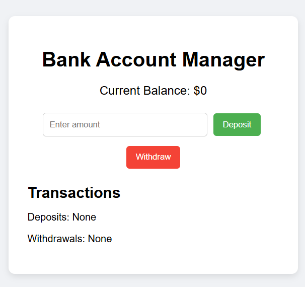

# Bank Account Management Program

A simple web app to simulate basic banking operations: create accounts, deposit and withdraw funds, and view balances.

## Features

- **Create Account**: Enter the account holder’s name and initial deposit to open a new account  
- **Deposit Funds**: Select an account and add a specified amount  
- **Withdraw Funds**: Select an account and withdraw a specified amount (with overdraft protection)  
- **View Balances**: See the current balance for each account in a list view  
- **Transaction History**: Track deposits and withdrawals per account  
- **Persistent Storage**: All data saved in your browser’s `localStorage`  
- **Responsive Design**: Works on both desktop and mobile  

## Demo

Open `index.html` in your browser or view the live demo:  
<https://sadykovismail.github.io/Java-script/32-bank-account-management-program/>



## Installation

_No dependencies required!_

1. Clone this repository:  
   ```bash
   git clone https://github.com/sadykovIsmail/Java-script/tree/main/32-bank-account-management-program
Open index.html in any modern web browser.

## Usage
- Create Account:
 
- Fill in Name and Initial Deposit, then click Create Account.
 
- Deposit:
 
- Select an account from the dropdown, enter an amount, and  click Deposit.
 
- Withdraw:

- Select an account, enter an amount, and click Withdraw.
 
- If withdrawal exceeds balance, an error message appears.
 
- View Balances & History:
 
- Balances update in real time.
 
- Click Show History next to each account to view its transactions.

## Tech Stack
- HTML5 for structure
 
- CSS3 for styling
 
- Vanilla JavaScript (ES6+) for logic and localStorage integration

## File Structure

32-bank-account-management-program/
├── index.html            # Main landing page
├── css/
│   └── styles.css        # App styles
├── js/
│   └── app.js            # Core banking logic & storage
└── README.md             # Project documentation

## Contributing
1) Fork the repo

2) Create a new branch:
git checkout -b feature/<your-branch-name>

3) Commit your changes:
git commit -m "Add awesome feature"

4) Push to the branch:
git push -u origin feature/<your-branch-name>

5) Open a Pull Request