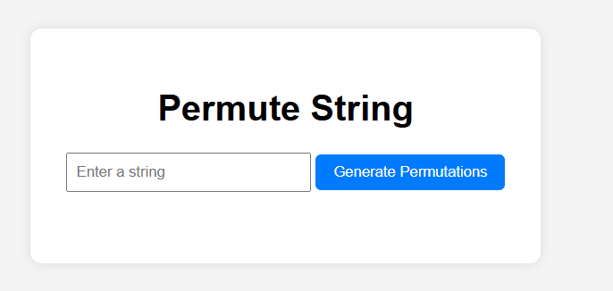

# Permute String

A web app to generate all permutations of a given string. Enter any text and instantly see every unique arrangement of its characters.

## Features

- **String Input**: Type or paste any text string  
- **Generate Permutations**: Click **Permute** to compute all unique permutations  
- **Result List**: View each permutation in a scrollable list  
- **Copy to Clipboard**: One-click button to copy all permutations  
- **Clear & Reset**: Clear input and results with a single click  
- **Responsive Design**: Works smoothly on desktop and mobile  

## Demo

Open `index.html` in your browser or view the live demo:  
<https://sadykovismail.github.io/Java-script/33-permute-string-app/>



## Installation

_No build tools or external dependencies required!_

1. Clone this repository:  
   ```bash
   git clone https://github.com/sadykovIsmail/Java-script/tree/main/33-permute-string-app
Open index.html in any modern web browser.

Usage
In the Input String field, type or paste your text (e.g. abc).

Click the Permute button (or press Enter).

See the list of all unique permutations appear below.

Click Copy All to copy every permutation to your clipboard.

Click Clear to reset the input and remove results.

Tech Stack
HTML5 for structure

CSS3 for styling and responsive layout

Vanilla JavaScript (ES6+) for permutation algorithm and DOM updates

File Structure

permute-string/
├── index.html           # Main HTML page
├── css/
│   └── styles.css       # App styles
├── js/
│   └── script.js        # Permutation logic and UI handlers
|
└── README.md            # Project documentation

Contributing
1) Fork the repo

2) Create a new branch:
git checkout -b feature/<your-branch-name>

3) Commit your changes:
git commit -m "Add awesome feature"

4) Push to the branch:
git push -u origin feature/<your-branch-name>

5) Open a Pull Request