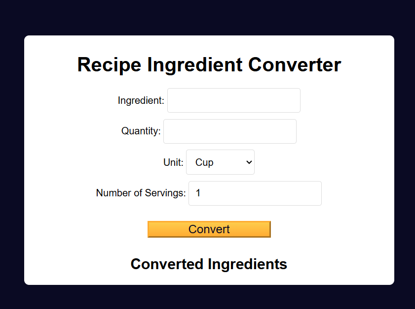

# Recipe Ingredient Converter

A handy web app to convert ingredient measurements between different units. Perfect for scaling recipes or adapting between metric and imperial systems.

## Features

- **Amount Input**: Enter a numeric value for the ingredient amount  
- **Unit Selection**: Choose source and target units (cups, tablespoons, teaspoons, grams, milliliters)  
- **Real-Time Conversion**: Results update instantly as you type or change units  
- **Ingredient Density**: Supports common ingredients (flour, sugar, butter, water) with density-based weight/volume conversion  
- **Clear & Reset**: One-click button to clear inputs and results  
- **Responsive Design**: Works on desktop and mobile  

## Demo

Open `index.html` in your browser or view the live demo:  
<http://127.0.0.1:5500/34-recipe-ingredient-converter/index.html>



## Installation

_No build tools or external dependencies required!_

1. Clone this repository:  
   ```bash
   git clone https://github.com/sadykovIsmail/Java-script/tree/main/34-recipe-ingredient-converter
Open index.html in any modern web browser.

Usage
In the Amount field, type the numeric quantity (e.g. 1.5).

Select the From unit and To unit from the dropdowns.

Choose your Ingredient if converting between weight and volume.

View the converted value instantly below.

Click Clear to reset all fields.

Tech Stack
HTML5 for markup

CSS3 for styling and responsive layout

Vanilla JavaScript (ES6+) for conversion logic, including density lookup and unit math

File Structure

recipe-ingredient-converter/
├── index.html                # Main HTML page with form and results
├── css/
│   └── styles.css            # App styles
├── js/
│   └── script.js             # Conversion logic 
|
└── README.md                 # Project documentation

Contributing
1) Fork the repo

2) Create a new branch:
git checkout -b feature/<your-branch-name>

3) Commit your changes:
git commit -m "Add awesome feature"

4) Push to the branch:
git push -u origin feature/<your-branch-name>

5) Open a Pull Request