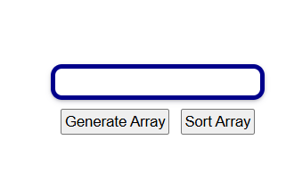

# Sorting Visualizer

An interactive web app to visualize common sorting algorithms in action. Learn how each algorithm orders an array step by step.

## Features

- **Algorithm Selection**: Choose from Bubble Sort, Selection Sort, Insertion Sort, Merge Sort, Quick Sort, and Heap Sort  
- **Array Generation**: Randomize a new array of adjustable size (e.g. 10–100 elements)  
- **Speed Control**: Slider to adjust animation speed (slow ↔ fast)  
- **Step-by-Step Animation**: Watch comparisons and swaps highlighted in real time  
- **Pause / Resume**: Pause the animation at any point and resume when ready  
- **Responsive Design**: Works on desktop and tablet layouts  

## Demo

Open `index.html` in your browser or view the live demo:  
<http://127.0.0.1:5500/35-sorting-visualizer/index.html>



## Installation

_No build tools or external dependencies required!_

1. Clone this repository:  
   ```bash
   git clone https://github.com/sadykovIsmail/Java-script/tree/main/35-sorting-visualizer
Open index.html in any modern web browser.

Usage
Select your desired Sorting Algorithm from the dropdown.

Use Array Size input to choose how many elements to visualize and click Generate Array.

Adjust the Speed slider to control how fast the animation runs.

Click Start to begin the visualization.

Use Pause to halt the animation and Resume to continue.

After completion, you can generate a new array or switch algorithms.

Tech Stack
HTML5 for layout

CSS3 for styling and responsive design

Vanilla JavaScript (ES6+) for array generation, algorithm logic, and DOM animation

File Structure
bash
Копировать
Редактировать
sorting-visualizer/
├── index.html            # Main HTML page
├── css/
│   └── styles.css        # App styles
├── js/
│   ├── script.js            # Main visualization logic
│
└── README.md             # Project documentation

Contributing
1) Fork the repo

2) Create a new branch:
git checkout -b feature/<your-branch-name>

3) Commit your changes:
git commit -m "Add awesome feature"

4) Push to the branch:
git push -u origin feature/<your-branch-name>

5) Open a Pull Request