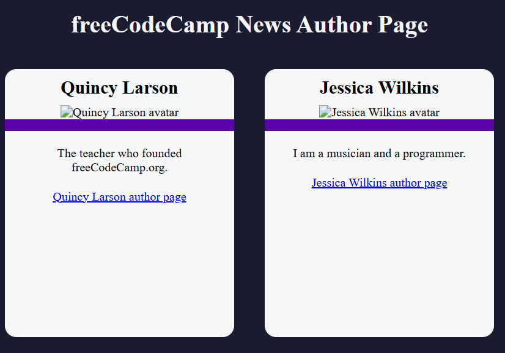

# FCC Authors Page

A responsive web page showcasing FreeCodeCamp authors, their profiles, and contributions. Ideal for learning API fetching, layout design, and interactive UI components.

## Features

- **Author Cards**: Displays each author’s avatar, name, username, and profile link  
- **API Integration**: Fetches author data dynamically from FreeCodeCamp’s API (or JSON file)  
- **Search & Filter**: Live search by author name or username  
- **Responsive Grid**: Automatically adjusts card layout for mobile, tablet, and desktop  
- **Loading State**: Shows a spinner while data is being fetched  
- **Error Handling**: Displays a friendly message if the data request fails  

## Demo

Open `index.html` in your browser or view the live demo:  
<https://sadykovismail.github.io/Java-script/36-fcc-authors-page/>



## Installation

_No build tools or external dependencies required!_

1. Clone this repository:  
   ```bash
   git clone https://github.com/sadykovIsmail/Java-script/tree/main/36-fcc-authors-page
Open index.html in any modern web browser.

Usage
On load, the page fetches author data and displays cards in a grid.

Use the Search input at the top to filter authors by name or username.

Click an author’s card or “View Profile” button to open their FreeCodeCamp profile in a new tab.

If data fails to load, an error message will appear—refresh to retry.

Tech Stack
HTML5 for markup

CSS3 (Flexbox & Grid) for styling and responsive layout

Vanilla JavaScript (ES6+) for API fetching, search/filter logic, and DOM manipulation

Fetch API for network requests

File Structure

fcc-authors-page/
├── index.html            # Main HTML page
├── css/
│   └── styles.css        # Page styles
├── js/
│   └── script.js            # Fetch & filter logic
└── README.md             # Project documentation

Contributing
1) Fork the repo

2) Create a new branch:
git checkout -b feature/<your-branch-name>

3) Commit your changes:
git commit -m "Add awesome feature"

4) Push to the branch:
git push -u origin feature/<your-branch-name>

5) Open a Pull Request