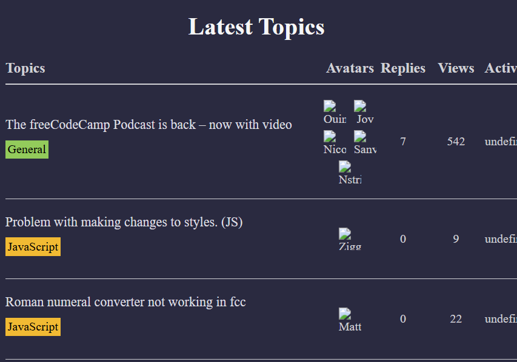

# FCC Forum

A simple, responsive web forum inspired by FreeCodeCamp’s community. Create discussion threads, post replies, and browse topics—all in your browser without a backend.

## Features

- **Create Threads**: Start a new discussion with a title and initial post  
- **Post Replies**: Add comments to any thread  
- **Thread List View**: See all threads sorted by most recent activity  
- **Thread Detail View**: Read a thread’s full conversation and reply inline  
- **Edit & Delete**: Update or remove your own threads and replies  
- **Search & Filter**: Live-search threads by title or content  
- **Persistent Storage**: All data saved in `localStorage` so your forum persists on refresh  
- **Responsive Design**: Mobile-friendly layout and navigation  

## Demo

Open `index.html` in your browser or view the live demo:  
<https://sadykovismail.github.io/Java-script/37-fcc-forum-leaderboard/>



## Installation

_No build tools or external dependencies required!_

1. Clone this repository:  
   ```bash
   git clone https://github.com/sadykovIsmail/Java-script/tree/main/37-fcc-forum-leaderboard
Open index.html in any modern web browser.

## Usage
On load, you’ll see a Thread List showing all existing discussions.

Click New Thread to open the thread creation form:

Enter a Title and Content, then click Create.

Click any thread title to view its Detail View and all replies.

In a thread, type your message in the Reply box and click Post Reply.

Use the Search input at the top to filter threads by keyword.

Hover over your own posts or threads to reveal Edit (✏️) and Delete (🗑️) buttons.

All changes are auto-saved in your browser—no server needed.

## Tech Stack
HTML5 for semantic markup

CSS3 (Flexbox & Grid) for styling and responsive layout

Vanilla JavaScript (ES6+) for forum logic, event handling, and localStorage integration

## File Structure

fcc-forum/
├── index.html             # Main HTML page with thread list & detail templates
├── css/
│   └── styles.css         # Forum styles and responsive rules
├── js/
│   └── script.js         # Core logic: create/read/update
|
└── README.md              # Project documentation

## Contributing
1) Fork the repo

2) Create a new branch:
git checkout -b feature/<your-branch-name>

3) Commit your changes:
git commit -m "Add awesome feature"

4) Push to the branch:
git push -u origin feature/<your-branch-name>

5) Open a Pull Request