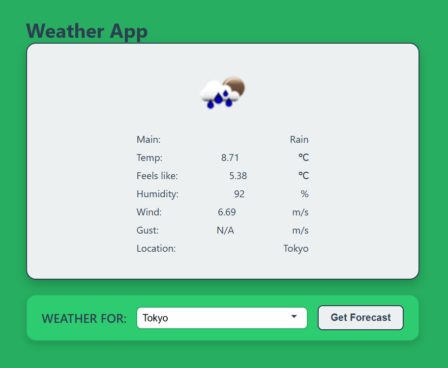

# Weather App

A responsive web app to fetch and display current weather (and optional forecast) for any city. Powered by the FreeCodeCamp weather proxy API.

## Features

- **City Search**: Enter or select a city to get its weather  
- **Current Conditions**: Displays temperature, weather description, icon, humidity, and wind speed  
- **5-Day Forecast**: View a simple multi-day forecast with high/low temps and icons  
- **Error Handling**: Friendly message if city not found or network fails  
- **Loading State**: Spinner while fetching data  
- **Responsive Design**: Adapts for mobile, tablet, and desktop  

## Demo

Open `index.html` in your browser or view the live demo:  
<https://sadykovismail.github.io/Java-script/38-weather-app/>



## Installation

_No build tools or external dependencies required!_

1. Clone this repository:  
   ```bash
   git clone https://github.com/sadykovIsmail/Java-script/tree/main/38-weather-app
Open index.html in any modern web browser.

## Usage
In the City input field, type the city name (e.g. London or New York).

Click Get Weather or press Enter.

View the Current Weather section for temperature, description, humidity, and wind.

Scroll to the Forecast section to see the next 5 days’ temps and icons.

If an error occurs, an alert or error panel will appear—try a different city or check your connection.

## Tech Stack
HTML5 for markup

CSS3 for styling and responsive layout

Vanilla JavaScript (ES6+) for Fetch API calls and DOM updates

FreeCodeCamp Weather Proxy (https://weather-proxy.freecodecamp.rocks/api/city/) for data

## File Structure

weather-app/
├── index.html            # Main HTML page with form & display panels
├── css/
│   └── styles.css        # App styles and responsive rules
├── js/
│   └── script.js        # Fetch logic, error handling & UI
|
└── README.md             # Project documentation

## Contributing
1) Fork the repo

2) Create a new branch:
git checkout -b feature/<your-branch-name>

3) Commit your changes:
git commit -m "Add awesome feature"

4) Push to the branch:
git push -u origin feature/<your-branch-name>

5) Open a Pull Request